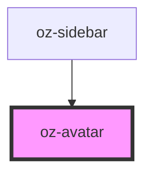

# oz-avatar

<!-- Auto Generated Below -->

## Properties

| Property | Attribute | Description | Type                                                | Default    |
| -------- | --------- | ----------- | --------------------------------------------------- | ---------- |
| `name`   | `name`    |             | `string`                                            | `''`       |
| `size`   | `size`    |             | `number`                                            | `32`       |
| `tone`   | `tone`    |             | `"forest" \| "mist" \| "navy" \| "ochre" \| "sand"` | `'forest'` |

## Dependencies

### Used by

 - [oz-sidebar](../oz-sidebar)

### Graph

----------------------------------------------

*Built with [StencilJS](https://stenciljs.com/)*
