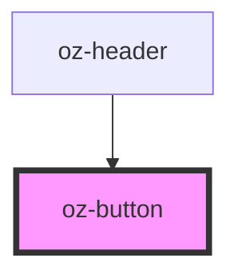

# oz-button

<!-- Auto Generated Below -->

## Properties

| Property   | Attribute  | Description | Type                                                                                 | Default     |
| ---------- | ---------- | ----------- | ------------------------------------------------------------------------------------ | ----------- |
| `disabled` | `disabled` |             | `boolean`                                                                            | `false`     |
| `size`     | `size`     |             | `"lg" \| "md" \| "sm"`                                                               | `'md'`      |
| `type`     | `type`     |             | `"button" \| "reset" \| "submit"`                                                    | `'button'`  |
| `variant`  | `variant`  |             | `"accent" \| "danger" \| "ghost" \| "outline" \| "primary" \| "secondary" \| "soft"` | `'primary'` |

## Dependencies

### Used by

 - [oz-header](../oz-header)

### Graph

----------------------------------------------

*Built with [StencilJS](https://stenciljs.com/)*
