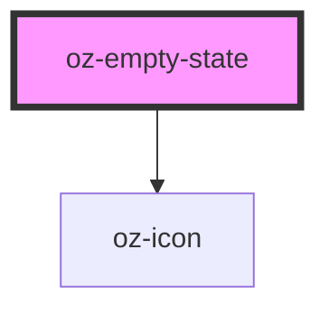

# oz-empty-state

<!-- Auto Generated Below -->

## Properties

| Property  | Attribute | Description | Type                                                                                                                                                                                                                                                                                               | Default     |
| --------- | --------- | ----------- | -------------------------------------------------------------------------------------------------------------------------------------------------------------------------------------------------------------------------------------------------------------------------------------------------- | ----------- |
| `body`    | `body`    |             | `string`                                                                                                                                                                                                                                                                                           | `undefined` |
| `heading` | `heading` |             | `string`                                                                                                                                                                                                                                                                                           | `''`        |
| `icon`    | `icon`    |             | `"arrow-down" \| "arrow-right" \| "bell" \| "calendar" \| "check" \| "dashboard" \| "doc" \| "download" \| "filter" \| "logout" \| "more" \| "plus" \| "portfolio" \| "products" \| "reporting" \| "search" \| "settings" \| "shield" \| "trend-down" \| "trend-up" \| "upload" \| "users" \| "x"` | `'doc'`     |

## Dependencies

### Depends on

- [oz-icon](../oz-icon)

### Graph

----------------------------------------------

*Built with [StencilJS](https://stenciljs.com/)*
