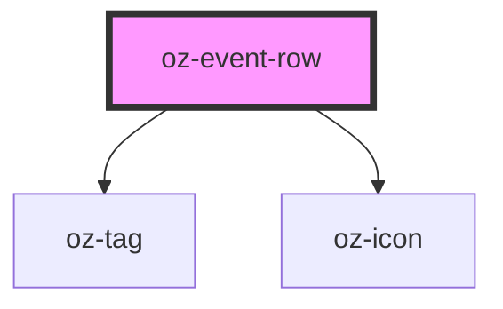

# oz-event-row

<!-- Auto Generated Below -->

## Properties

| Property    | Attribute    | Description | Type                                                                            | Default    |
| ----------- | ------------ | ----------- | ------------------------------------------------------------------------------- | ---------- |
| `amount`    | `amount`     |             | `string`                                                                        | `''`       |
| `dateDay`   | `date-day`   |             | `string`                                                                        | `''`       |
| `dateMonth` | `date-month` |             | `string`                                                                        | `''`       |
| `kind`      | `kind`       |             | `string`                                                                        | `''`       |
| `product`   | `product`    |             | `string`                                                                        | `''`       |
| `tone`      | `tone`       |             | `"danger" \| "forest" \| "navy" \| "neutral" \| "ochre" \| "success" \| "warn"` | `'forest'` |

## Dependencies

### Depends on

- [oz-tag](../oz-tag)
- [oz-icon](../oz-icon)

### Graph

----------------------------------------------

*Built with [StencilJS](https://stenciljs.com/)*
