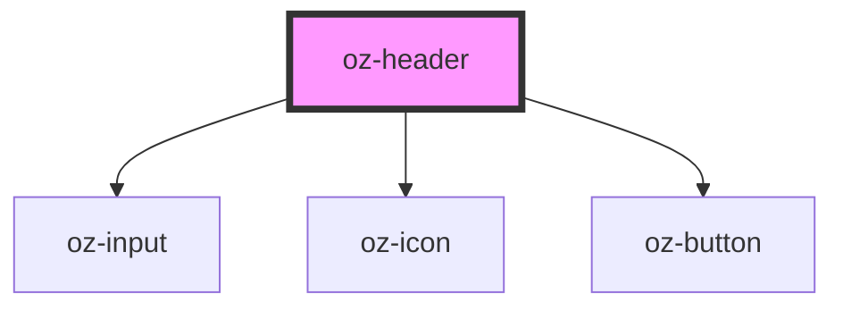

# oz-header

<!-- Auto Generated Below -->

## Properties

| Property            | Attribute            | Description | Type     | Default                                  |
| ------------------- | -------------------- | ----------- | -------- | ---------------------------------------- |
| `heading`           | `heading`            |             | `string` | `'Tableau de bord'`                      |
| `notificationCount` | `notification-count` |             | `number` | `3`                                      |
| `searchPlaceholder` | `search-placeholder` |             | `string` | `'Rechercher un ISIN, produit, client…'` |

## Dependencies

### Depends on

- [oz-input](../oz-input)
- [oz-icon](../oz-icon)
- [oz-button](../oz-button)

### Graph

----------------------------------------------

*Built with [StencilJS](https://stenciljs.com/)*
