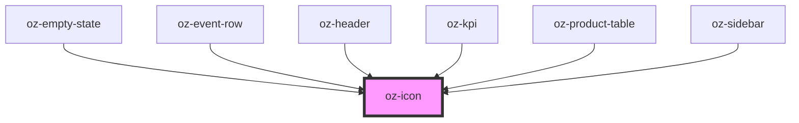

# oz-icon

<!-- Auto Generated Below -->

## Properties

| Property      | Attribute      | Description | Type                                                                                                                                                                                                                                                                                               | Default          |
| ------------- | -------------- | ----------- | -------------------------------------------------------------------------------------------------------------------------------------------------------------------------------------------------------------------------------------------------------------------------------------------------- | ---------------- |
| `color`       | `color`        |             | `string`                                                                                                                                                                                                                                                                                           | `'currentColor'` |
| `name`        | `name`         |             | `"arrow-down" \| "arrow-right" \| "bell" \| "calendar" \| "check" \| "dashboard" \| "doc" \| "download" \| "filter" \| "logout" \| "more" \| "plus" \| "portfolio" \| "products" \| "reporting" \| "search" \| "settings" \| "shield" \| "trend-down" \| "trend-up" \| "upload" \| "users" \| "x"` | `'dashboard'`    |
| `size`        | `size`         |             | `number`                                                                                                                                                                                                                                                                                           | `16`             |
| `strokeWidth` | `stroke-width` |             | `number`                                                                                                                                                                                                                                                                                           | `1.6`            |

## Dependencies

### Used by

 - [oz-empty-state](../oz-empty-state)
 - [oz-event-row](../oz-event-row)
 - [oz-header](../oz-header)
 - [oz-kpi](../oz-kpi)
 - [oz-product-table](../oz-product-table)
 - [oz-sidebar](../oz-sidebar)

### Graph

----------------------------------------------

*Built with [StencilJS](https://stenciljs.com/)*
