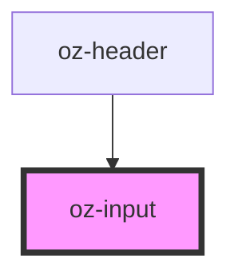

# oz-input

<!-- Auto Generated Below -->

## Properties

| Property      | Attribute     | Description | Type                   | Default     |
| ------------- | ------------- | ----------- | ---------------------- | ----------- |
| `disabled`    | `disabled`    |             | `boolean`              | `false`     |
| `error`       | `error`       |             | `boolean`              | `false`     |
| `hint`        | `hint`        |             | `string`               | `undefined` |
| `label`       | `label`       |             | `string`               | `undefined` |
| `placeholder` | `placeholder` |             | `string`               | `undefined` |
| `size`        | `size`        |             | `"lg" \| "md" \| "sm"` | `'md'`      |
| `type`        | `type`        |             | `string`               | `'text'`    |
| `value`       | `value`       |             | `string`               | `''`        |

## Events

| Event      | Description | Type                  |
| ---------- | ----------- | --------------------- |
| `ozChange` |             | `CustomEvent<string>` |
| `ozInput`  |             | `CustomEvent<string>` |

## Dependencies

### Used by

 - [oz-header](../oz-header)

### Graph

----------------------------------------------

*Built with [StencilJS](https://stenciljs.com/)*
