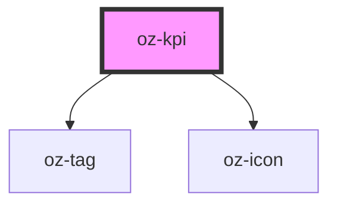

# oz-kpi

<!-- Auto Generated Below -->

## Properties

| Property    | Attribute    | Description | Type                                                                            | Default     |
| ----------- | ------------ | ----------- | ------------------------------------------------------------------------------- | ----------- |
| `delta`     | `delta`      |             | `string`                                                                        | `undefined` |
| `deltaTone` | `delta-tone` |             | `"danger" \| "forest" \| "navy" \| "neutral" \| "ochre" \| "success" \| "warn"` | `'success'` |
| `label`     | `label`      |             | `string`                                                                        | `''`        |
| `sub`       | `sub`        |             | `string`                                                                        | `undefined` |
| `unit`      | `unit`       |             | `string`                                                                        | `undefined` |
| `value`     | `value`      |             | `string`                                                                        | `''`        |

## Dependencies

### Depends on

- [oz-tag](../oz-tag)
- [oz-icon](../oz-icon)

### Graph

----------------------------------------------

*Built with [StencilJS](https://stenciljs.com/)*
