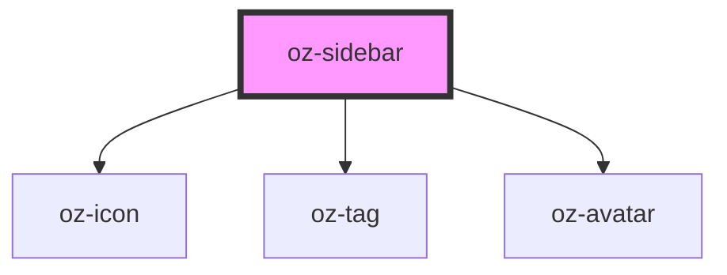

# oz-sidebar

<!-- Auto Generated Below -->

## Properties

| Property | Attribute | Description | Type     | Default            |
| -------- | --------- | ----------- | -------- | ------------------ |
| `active` | `active`  |             | `string` | `'dashboard'`      |
| `org`    | `org`     |             | `string` | `'Cabinet Helios'` |
| `user`   | `user`    |             | `string` | `'Marie Laurent'`  |

## Dependencies

### Depends on

- [oz-icon](../oz-icon)
- [oz-tag](../oz-tag)
- [oz-avatar](../oz-avatar)

### Graph

----------------------------------------------

*Built with [StencilJS](https://stenciljs.com/)*
