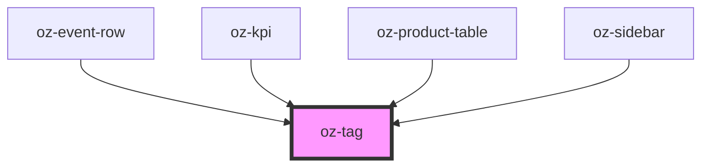

# oz-tag

<!-- Auto Generated Below -->

## Properties

| Property  | Attribute | Description | Type                                                                            | Default     |
| --------- | --------- | ----------- | ------------------------------------------------------------------------------- | ----------- |
| `tone`    | `tone`    |             | `"danger" \| "forest" \| "navy" \| "neutral" \| "ochre" \| "success" \| "warn"` | `'neutral'` |
| `variant` | `variant` |             | `"outline" \| "soft" \| "solid"`                                                | `'soft'`    |

## Dependencies

### Used by

 - [oz-event-row](../oz-event-row)
 - [oz-kpi](../oz-kpi)
 - [oz-product-table](../oz-product-table)
 - [oz-sidebar](../oz-sidebar)

### Graph

----------------------------------------------

*Built with [StencilJS](https://stenciljs.com/)*
